#Up For Grabs
**Work in progress**

<!-- This app is designed to solve the problem of an overcrowded closet... which is a problem I have. So very bad. Anywhoooooo ugh. SOO:

An application for cataloging(sp??), sharing, and ultimately getting rid of unwanted clothing items. -->

##Specifications

###User stories/Features

####Guest Features

1. Guests can view the application's home page to see information about the app itself and access _limited_ functionality.
2. Guests can view public collections, or 'closets', of registered users, which contain clothing items users would like to give away.
3. Guests can search clothing items and browse what's been put up for freesies.
4. Guests can create user accounts using their email address.
  - Verification??

####User Features

All Guest features, plus:

1. **Users can customize their profiles with:**
  - An avatar,
  - Email address (kept private),
  - Display name,
  - Location (general, kept private), and
  - "About" section.

  All fields except for username are optional.

2. **Users can request a lost password.**

3. **Users can create new clothing items to be added to their "closet".**

  Each item will include:
  - A photo of the clothing item,
  - The item's size,
  - Item's color,
  - Description/notes,
  - Expiration date* (default 2 months), and
  - Tags for any additional classifiers including material, brand, occasion, etc.

  Item photo, size, and color are required; other fields are optional.
  - **Users can take photos using their cell phone cameras OR upload them from their computer.**

  _*See feature #5._

4. **Users can mark any of their clothing items as "no longer available."**
  - This will move the item out of their closet and into a "previous items" category. Items in this category wil not show up in browse/search views or when viewing the user's closet, but can be made available again.

5. **Users can set an "expiration date" for each item in their closet.**
  - After this date, the item will be marked as "no longer available."
  - If the user has an item or items in their closet that will expire in several days, they will receive an email reminding them, along with links to organizations in their area that accept clothing donations.

6. **Users can share what they want to give away on Facebook as a link to their closet.**

7. **Users can add items from others' collections to their "Watch" or "Wish" list.**
  - Users are alerted via email if the item is expiring soon or if it is no longer available.

8. **Users can `favorite` another user's entire closet.**
  - User can then view and easily navigate to any of their favorited closets.

9. **Users will be able to `request` items that another user has put up for giveaway.**
  - This request will include a message from the requesting user.
  - The recipient will be able to reply to this message in order to confirm or deeeeny.

9. **Users will have access to a message "inbox,"** containing:
  - Requests to take their unwanted clothing item,
  - Alerts when someone has favorited their closet, and
  - Alerts when an item has expired.

<!-- ####Admin Features??? -->

####Data Structure

#####Resources:
  - **User Accounts**
    - Favorites
    - Wishlist Items
    - User's Closets
    - User's Clothing Items
  - **Closets**
    - Closet's Clothing Items
  - **Clothing Items**
    - Item Tags
  - **Tags**
  - **Messages**

#####ERD

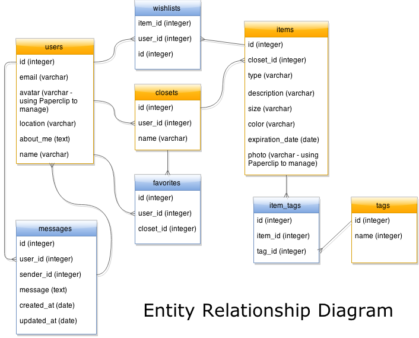

#####API Routes

*Users*

| HTTP Verb | Route | Description |
| --------- | ----- | ----------- |
| GET | "/api/users" | Returns a list of all users. |
| POST | "/api/users" | Creates a new user in the database. |
| GET | "/api/users/:id" | Returns a single user's data. |
| PUT | "/api/users/:id" | Updates an existing user in the database. |
| DELETE | "/api/users/:id" | Deletes a user from the database. |

| HTTP Verb | Route | Description |
| --------- | ----- | ----------- |
| GET | "/api/user" | Returns the logged in user's profile data. |
| GET | "/api/user/closets" | Returns all of the logged in user's closets. |
| GET | "/api/user/favorites" | Returns all of a specific user's favorite closets. |
| GET | "/api/user/wishlist" | Returns all items the user has added to their wishlist. |
| GET | "/api/user/messages" | Returns all messages sent by and to the user. |

*Closets*

| HTTP Verb | Route | Description |
| --------- | ----- | ----------- |
| GET | "/api/closets" | Returns all closets in DB. |
| POST | "/api/closets" | Creates a new closet. |
| GET | "/api/closet/:id" | Returns information about a specific closet and general info about its contents. |
| PUT | "/api/closets/:id" | Updates an existing closet. |
| DELETE | "/api/closets/:id" | Deletes an existing closet. |

*Items*

| HTTP Verb | Route | Description |
| --------- | ----- | ----------- |
| GET | "/api/items" | Returns all clothing items in DB. |
| GET | "/api/items/:id" | Returns all clothing items in DB. |
| GET | "/api/closets/:id/items" | Returns the items within a particular closet. |
| POST | "/api/items" | Creates a new item. |
| PUT | "/api/items/:id" | Updates an item. |
| DELETE | "/api/items/:id" | Deletes an item. |

*Messages*

| HTTP Verb | Route | Description |
| --------- | ----- | ----------- |
| POST | "/api/messages" | Creates a new message. |
| DELETE | "/api/messages/:id" | Deletes a message. |

####Wireframes
**Guest Views**

| Home Page | Signup Page | Login Page |
| --- | --- | --- |
| 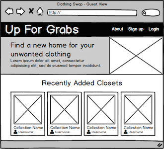 |  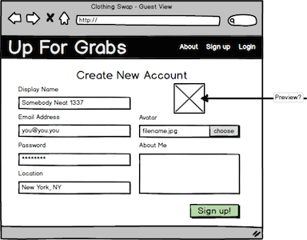 | 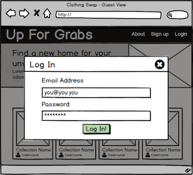 |

**User Views**

| Profile Page |
| --- |
| 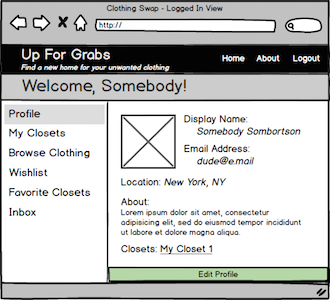 |

| My Closet - Main | My Closet - View Item |
| --- | --- |
| 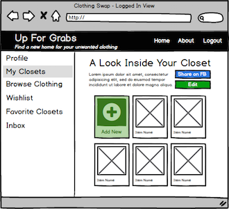 |  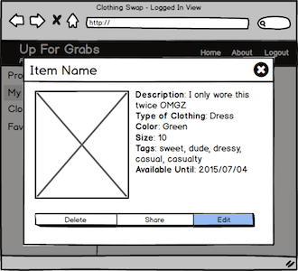 |
| My Closet - Add Item | My Closet - Edit Item |
| 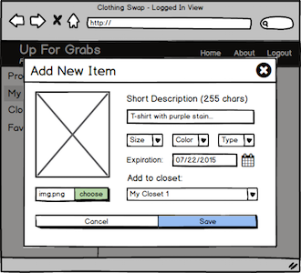 | 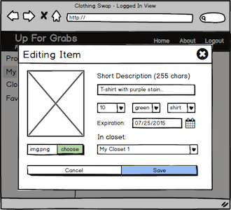 |

| Browse Clothing - Search | Browse Clothing - View Item |
| --- | --- |
| 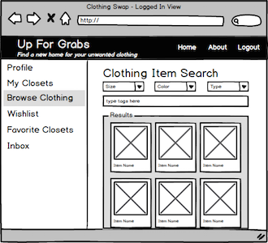 |  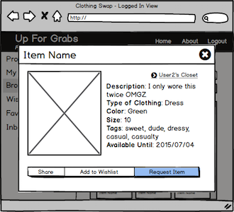 |

| Wishlist - Search | Wishlist - View Item |
| --- | --- |
| 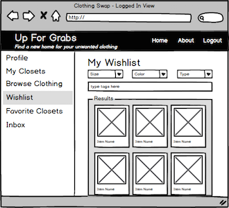 |  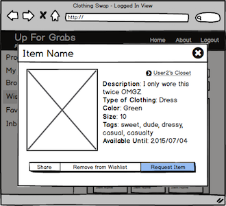 |

| Other User's Closet |
| --- |
| 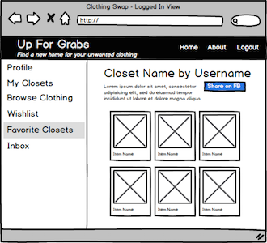 |

| Inbox View |
| --- |
| 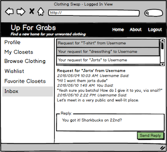 |

####Technologies

Server Side - Ruby Gems

- sendgrid
- Ruby on Rails (zoooom)
- paperclip

Client Side JS

- mustache
- jQuery
- backbone & underscore

CSS

- [Pure CSS](http://purecss.io/)
